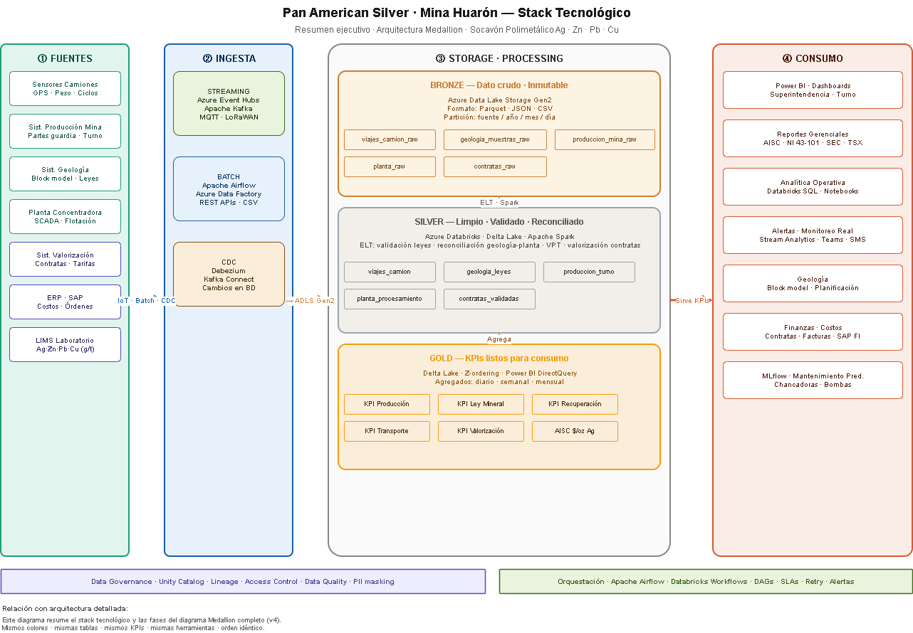
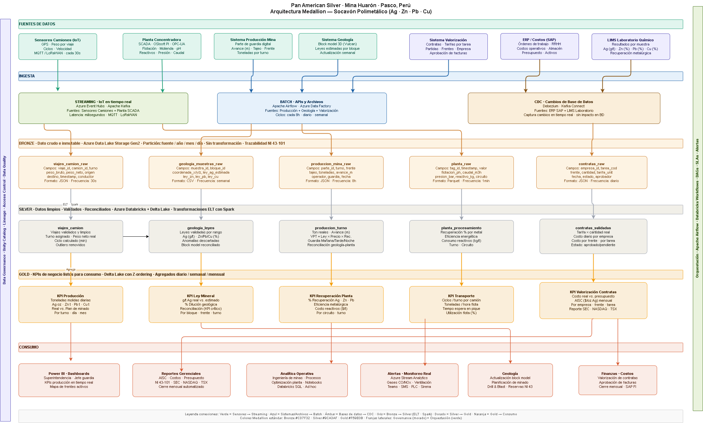

# ⛏️ Mining Data Lakehouse (Databricks + Azure)

End-to-end data platform for underground polymetallic mining operations. 
This project designs a modern Data Lakehouse architecture based on a real-world mining scenario, integrating:

- Mine production systems
- Geological data (ore grades)
- Haulage and transport (IoT sensors)
- Plant processing
- Contractor costing and valuation

The solution follows a **Medallion Architecture (Bronze → Silver → Gold)** using Azure Databricks to transform raw operational data into business-ready insights.


## 🏢 Real Company · Real Operation

**Pan American Silver Corp** (NASDAQ: PAAS) · **Huarón Mine, Pasco, Peru**
Underground silver-zinc-lead-copper mine · 2,500 TPD · 3.33 MOz Ag produced (2025)

> Architecture proposal based on public data and first-hand operational experience in underground polymetallic mining. Not Pan American Silver's official internal system.


## 💡 Business Context

This project is inspired by real experience working in underground mining operations, where I developed:
- Mine production systems
- Geological data integration
- Contractor valuation systems

The goal is to simulate how modern data platforms can integrate these domains to answer key business questions such as:
- Cost per ton
- Ore grade quality by zone
- Contractor performance
- Production efficiency


## 🏗️ Architecture Diagram

###  Executive Summary — Stack & Tools


### Medallion Architecture (Bronze → Silver → Gold)



## 🚀 Key Technical Highlights

- Multi-latency data integration (stream + batch + weekly geological model)
- Real-time IoT ingestion for underground operations
- End-to-end cost calculation (contractor valuation)
- Production vs geological reconciliation pipeline
- Medallion architecture using Delta Lake


 ## 🧩 The Hard Problem

Multi-latency grade reconciliation — joining three sources with radically different update frequencies:

- Truck production stream → every 30 seconds
- Lab grade results → every 8 hours
- Geological block model → weekly
- This stream-to-static join pattern is one of the most technically demanding problems in industrial Data Engineering — and the most valuable KPI in mining.


## ⚡ What this pipeline does

| Layer | Tables | Key transformation |
|---|---|---|
| **Bronze** | `viajes_camion_raw` · `geologia_muestras_raw` · `produccion_mina_raw` · `planta_raw` · `contratas_raw` | Raw · immutable · NI 43-101 audit trail |
| **Silver** | `viajes_camion` · `geologia_leyes` · `produccion_turno` · `planta_procesamiento` · `contratas_validadas` | Validated · grade reconciliation · VPT · contractor costing |
| **Gold** | `KPI Producción` · `KPI Ley Mineral` · `KPI Recuperación` · `KPI Transporte` · `KPI Valorización` | Business KPIs · daily/weekly/monthly aggregates |


## 🛠️ Tech Stack

```
Sources          →  Ingestion           →  Processing         →  Consumption
─────────────────────────────────────────────────────────────────────────────
IoT Sensors         Azure Event Hubs       Azure Databricks      Power BI
SCADA / PI          Apache Kafka           Delta Lake            Stream Analytics
ERP SAP             Debezium CDC           Apache Spark          MLflow
LIMS Lab            Apache Airflow         Unity Catalog         Teams / SMS
Block Model         Azure Data Factory     Azure ADLS Gen2       Databricks SQL
```

This stream-to-static join pattern is one of the most technically demanding problems in industrial Data Engineering — and the most valuable KPI in mining.

---

*Portfolio project · April 2026*
